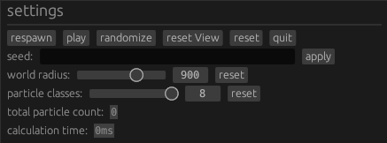

# Smarticles

A Rust port of [Brainxyz's Artificial Life](https://www.youtube.com/watch?v=0Kx4Y9TVMGg)
simulator with some fun features.

> *A simple program to simulate primitive Artificial Life using simple rules of
> attraction or repulsion among atom-like particles, producing complex
> self-organzing life-like patterns.*
> 
> – from the [original repository](https://github.com/hunar4321/life_code)


## Smarticles fork changes compared to original 

- [x] add more particle types
- [ ] separate the interface/display thread from the simulation thread for improved performance

## Running the App

To run this, you will need Rust installed, which you can do by following the
installation instructions on the [Rust website](https://www.rust-lang.org/).
You should then have `cargo` installed, which is the command line program
for managing and running Rust projects.

You can check your version of `cargo` in the command line:

```commandline
cargo --version
cargo 1.64.0-nightly (85b500cca 2022-07-24)
```

Once done, download or clone this repository to your preferred location and
run the program using `cargo` like so:

```commandline
cd ~/Rust/smarticles
cargo run
```

## How to Use It

First, watch it in action. Press the `Randomize` button, which will spawn a
bunch of particles with randomized settings. Then, press `Play` to run the
simulation.



Try randomizing it a few times and seeing what kind of results you get.


There are 4 particle types. You can change the behavior of each with the sliders:


`Power` is the particle's attraction to particles of the other type. A positive
number means it is attracted to them, and negative means it is repulsed away.
`Radius` is how far away the particle can sense particles of that type.

You can adjust these parameters while the simulation is running if you want to
see the effect they have:

## Sharing Simulations

The `Seed` field is the *D.N.A* of your particle system. It contains all the
information needed to replicate the current simulation. Pressing `Randomize`
will give you random seeds, but you can also enter a custom one.

What does *your* name look like?


> ☝️ literally the inside of my brain ☝️

If you start adjusting parameters, you'll notice the seed changes to a code
that begins with the `@` symbol. These are custom-encoded simulations, which
you can share by copying the entire code.

The code will be partially cut-off by the textbox, so make sure you select it all
before copying.

